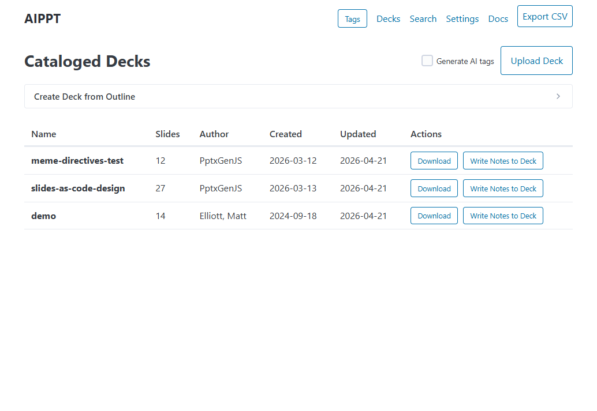
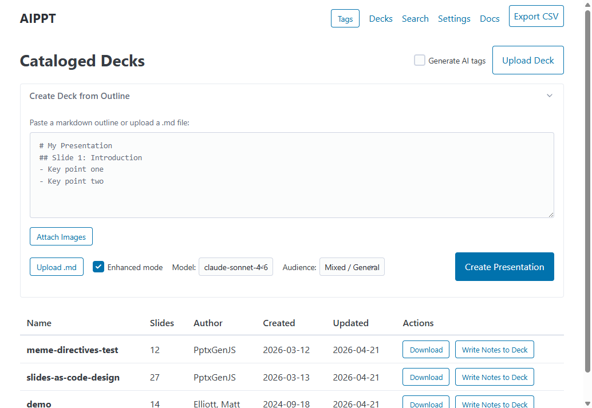
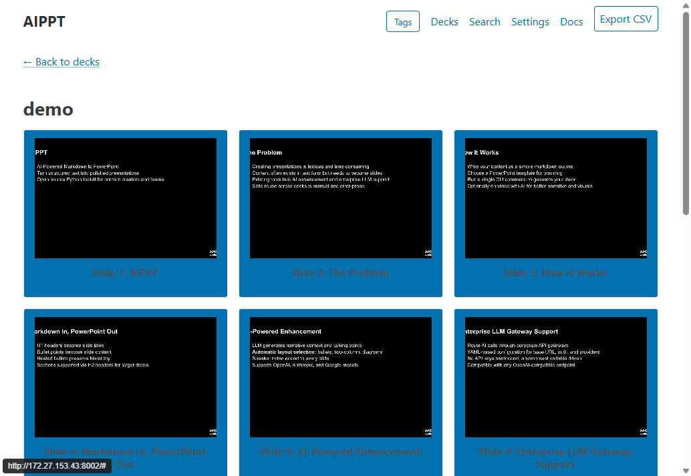
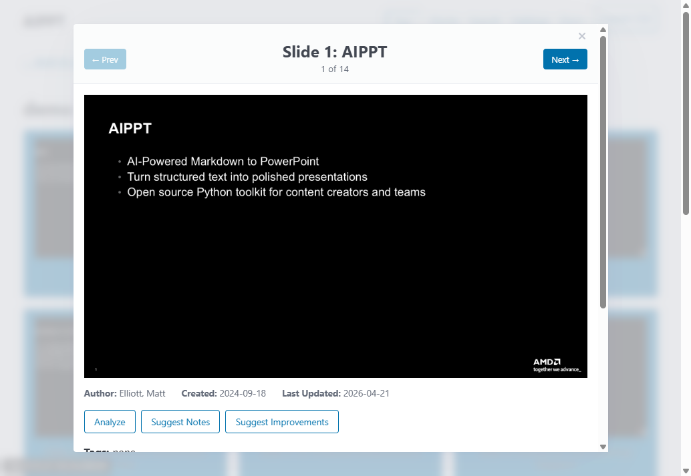
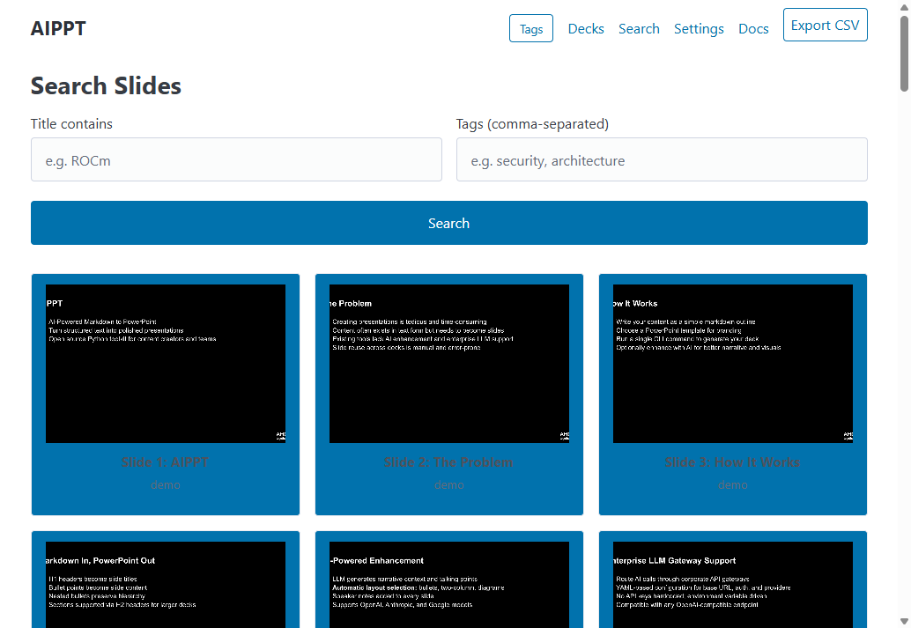
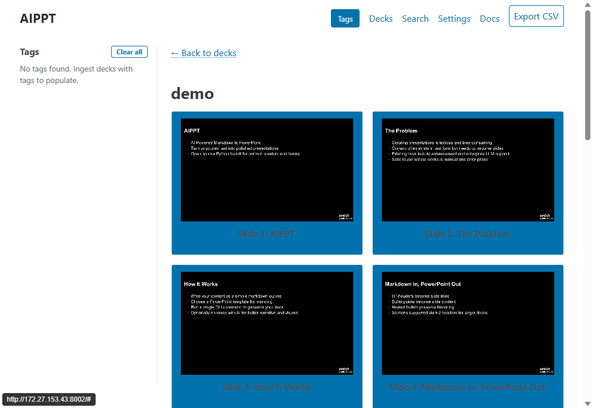
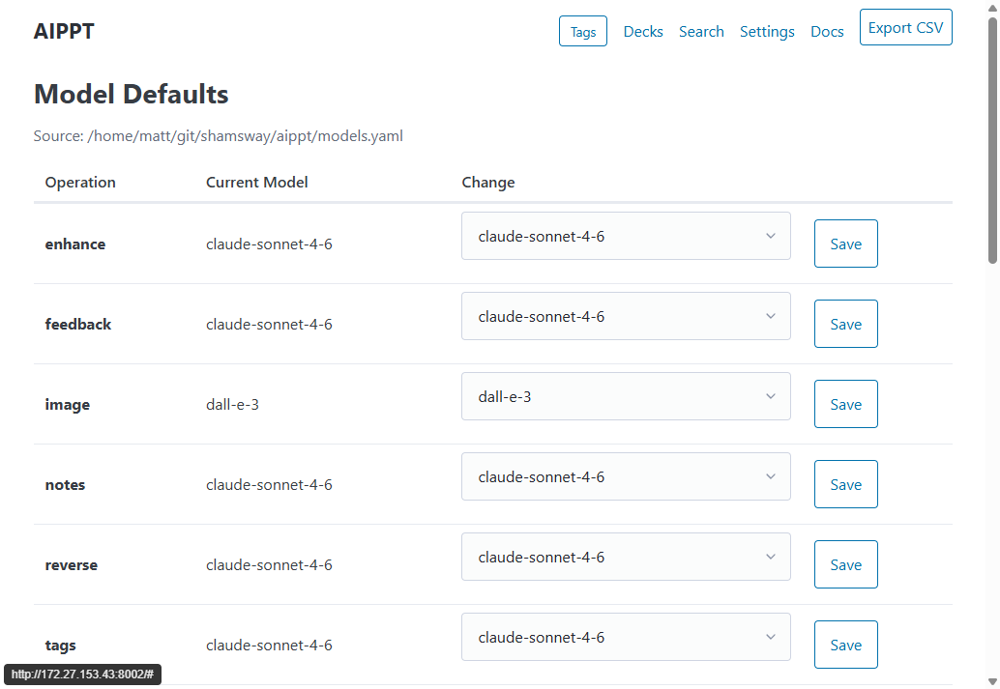
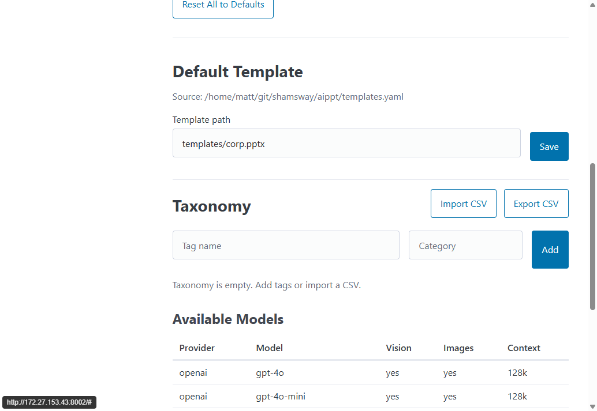
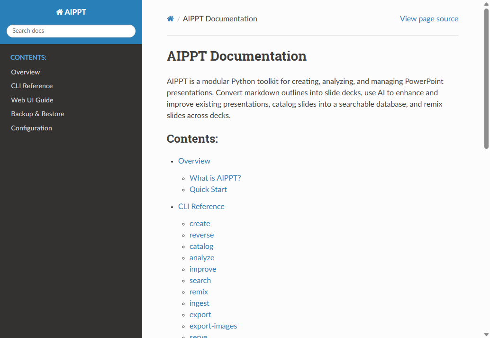

# AIPPT

A Python toolkit for creating, cataloging, and improving PowerPoint presentations from markdown — with optional AI enhancement, a searchable slide library, and Claude Code skills that wrap the whole pipeline in conversational workflows.



## What's in the box

AIPPT ships three ways to use it. Pick whichever fits the task.

| Surface | Best for | Entry point |
|---------|----------|-------------|
| **Web UI** (FastAPI + htmx) | Browsing the slide library, ad-hoc deck creation, AI feedback on individual slides | `./serve.sh` |
| **CLI** (`aippt.py`) | Scripting, batch ingest, gateway-routed LLM jobs, CI | `python aippt.py <command>` |
| **Claude Code skills** | End-to-end workflows: source material → outline → deck → review | `/create-outline`, `/create-deck`, `/deck-review` |

All three share the same SQLite slide catalog, model configuration, and outline format.

## Install

Requires Python 3.10+ and (optionally) Node.js if you plan to use the `pptxgenjs` deck-generation engine.

```bash
git clone https://github.com/shamsway/aippt.git
cd aippt
python -m venv venv
source venv/bin/activate
pip install -r requirements.txt
python aippt.py models init   # creates models.yaml from the example
```

Set API keys for whichever providers you want to use:

```bash
export OPENAI_API_KEY=...
export ANTHROPIC_API_KEY=...
export GEMINI_API_KEY=...
```

If your organization routes LLM traffic through a gateway, see [Gateway configuration](#gateway-configuration) below.

## Quick start

**Launch the web UI:**

```bash
./serve.sh                    # defaults to port 8001
# or directly:
python aippt.py serve --port 8001 --host 0.0.0.0
```

Then open `http://localhost:8001/`.

**Generate a deck from the CLI:**

```bash
python aippt.py create outline.md templates/default.pptx output/deck.pptx --enhance
```

**Use the Claude Code workflow** (see [Claude Code skills](#claude-code-skills)):

```
/create-outline path/to/source-material
/create-deck    outlines/my-deck.md
/deck-review    output/my-deck.pptx
```

## The web UI

The web UI is the easiest way to browse a deck library, create new presentations, and run AI analysis on individual slides. Launch it with `./serve.sh`.

### Cataloged decks

The landing page lists every deck that's been ingested into the catalog. Each row links to a thumbnail grid of that deck's slides; the **Upload Deck** button ingests a `.pptx` file (and optionally generates AI tags), and **Export CSV** dumps the full slide catalog.


### Create a deck from an outline

Expand **Create Deck from Outline** to paste or upload a markdown outline, pick a model and audience, and generate a presentation in place. Enhanced mode runs the LLM layout/notes/visual pass.



### Browse a deck

Clicking a deck row opens its slide grid. Each thumbnail is clickable for a detail view.



### Inspect a single slide

The slide detail modal shows the rendered image alongside one-click AI actions: **Analyze** (visual feedback), **Suggest Notes** (speaker notes), **Suggest Improvements** (rewrite proposals), and tag editing.



### Search across the library

Search by title substring or tag list. Results render as thumbnails so you can spot the right slide visually.



### Tags

The Tags sidebar filters the deck list to slides matching any selected tags. Tags can be added manually or generated by the AI tagger during ingest.



### Settings

Settings exposes the per-operation model defaults (`enhance`, `feedback`, `notes`, `tags`, `image`, `reverse`, `improve`), the default template path, and the taxonomy editor. Defaults are persisted to `models.yaml` and `templates.yaml`.





### Docs

The **Docs** link in the top nav serves the full Sphinx documentation (CLI reference, web UI guide, configuration, backup/restore).



## Claude Code skills

AIPPT ships three [Claude Code](https://claude.ai/code) skills that wrap the toolkit in conversational, end-to-end workflows. See [`SKILLS.md`](SKILLS.md) for full details.

```
Source material → /create-outline → outline.md → /create-deck → deck.pptx → /deck-review → feedback
```

| Slash command | What it does |
|---------------|--------------|
| `/create-outline` | Turn raw source material (docs, code, repos, web pages) into a structured aippt-format markdown outline. Captures screenshots via Playwright for visual slides. |
| `/create-deck` | Generate a `.pptx` from an outline using either the **pptxgenjs** engine (creative, themed JS scripts) or **python-pptx** (strict template/placeholder fills). |
| `/deck-review` | Visual QA on a finished deck — renders slides to images, runs `aippt analyze`, captures app screenshots, drafts Excalidraw diagrams. |

The `/create-deck` workflow generates a JS or Python build script alongside the PPTX. The script is treated as the source of truth for the deck — see [`outlines/slides-as-code-design.md`](outlines/slides-as-code-design.md) for the design behind the upcoming `/edit-deck` skill, which closes the loop with conversational deck editing.

## CLI

The CLI exposes every capability as a subcommand under a single entry point. Add `--debug` to any command for verbose logging.

```bash
python aippt.py <command> [options]
```

| Command | Purpose |
|---------|---------|
| `create` | Build a `.pptx` from a markdown outline (`--enhance` for AI layout/notes) |
| `reverse` | Convert an existing `.pptx` back to a markdown outline |
| `ingest` | One-step pipeline: export images, catalog the deck, optionally tag |
| `catalog` | Catalog a deck without exporting images |
| `export-images` | Export slides as PNG via PowerPoint COM (Windows / WSL) |
| `analyze` | Run AI analysis: `feedback`, `notes`, `tags`, or `improvements` |
| `improve` | LLM-powered rewrite of slide content (with revision history) |
| `search` | Query cataloged slides by tag, title, or section |
| `remix` | Assemble a new deck from a YAML manifest of slides |
| `write-notes` | Push speaker notes from the catalog back into a `.pptx` |
| `tags`, `tag`, `untag` | Manage the taxonomy and per-slide tags |
| `models` | Inspect or change per-operation model defaults |
| `serve` | Launch the web UI |

Full reference with every flag and example: `docs/cli.rst` (or the rendered Sphinx site via the **Docs** nav link).

## Configuration

### Models (`models.yaml`)

`python aippt.py models init` writes a starter `models.yaml` from the bundled example. The file has two sections:

- **registry** — every model the system can use, with provider, context window, and capability flags
- **defaults** — which model handles each operation (`enhance`, `improve`, `feedback`, `notes`, `tags`, `image`)

CLI `--model` flags and the web UI Settings page both override these defaults. Models from OpenAI, Anthropic, and Google are supported out of the box; custom models can be added to the registry.

### Gateway configuration

For corporate API gateways, drop a `gateway.yaml` in the project root (or pass `--gateway-config path/to/gateway.yaml`):

```yaml
gateway:
  base_url: "https://llm-api.example.com"
  auth_header: "Ocp-Apim-Subscription-Key"
  auth_value_env: "GATEWAY_API_KEY"
providers:
  openai:
    path: "/OpenAI"
  anthropic:
    path: "/Anthropic"
  google:
    path: "/VertexAI"
```

Every command that calls an LLM picks this up automatically.

## Outline format

AIPPT outlines are plain markdown with a small set of conventions: H1/H2 sections and slides, bullet hierarchy, optional YAML frontmatter (`audience`, `goal`, `tone`), and per-slide `LAYOUT:` / `IMAGE:` directives. Layout types are `bullet`, `numbered`, `two_column`, `diagram`, and `basic`.

The full specification — including bold lead-in patterns, two-column syntax, content density guidelines, and a complete worked example — lives in [`OUTLINE-FORMAT.md`](OUTLINE-FORMAT.md). The spec is self-contained so an LLM can generate valid outlines from source material without additional context.

## Project layout

```
aippt/                  # Python package: CLI, web app, generators, analyzers
skills/                 # Claude Code skill definitions
templates/              # Bundled PowerPoint templates
themes/                 # pptxgenjs theme YAMLs
outlines/               # Example and working outlines
docs/                   # Sphinx documentation source
serve.sh                # Web UI launcher
aippt.py                # CLI entry point
```

## Documentation

- **CLI reference, web UI guide, backup/restore, configuration:** `docs/` (Sphinx — also served at `/docs` when the web UI is running)
- **Outline authoring:** [`OUTLINE-FORMAT.md`](OUTLINE-FORMAT.md)
- **Claude Code skills:** [`SKILLS.md`](SKILLS.md)
- **Slides-as-code design (in progress):** [`outlines/slides-as-code-design.md`](outlines/slides-as-code-design.md)
